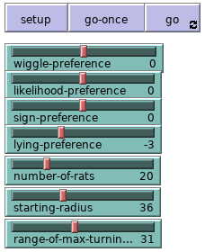

# Welcome to the Sign Model Repo

## Basic Model Info

The model experiments with behavioral genetics and how rats behave when the characteristic of following signs is passed on.
This was based on the Russian Fox Experiment, which started in 1959 by Dmitry Belyayev.

### Goal

To demonstrate that artificial constraints (selective breeding) can influence how rats behave for finding foods.

## Legend

In the SelectiveBreeding model, there are two major agents that interact
to represent how rats can use signs to determine the location of food.

### Rats
 

 - White : rats that have eaten and need to return outside the perimeter
 - Grey  : rats that are searching for food
 - Green : rats that are following sign directions
 - Orange : rats that noticed a sign in the area

 
 
 
 

### Signs

 - Yellow : Honest
 - Red : Misleading

 
 

### Food Source

 

### Toggles
 
